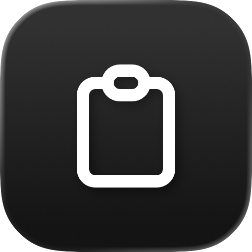

# clipboard-controller

<p align="center">
  
  
</p>

A macOS menu bar application that does two things with your clipboard.

**It remembers.** Every text, link and image that you copy goes into a history.
The menu gives any of them back with one click.

**It cleans.** The text that you copy loses the fonts, the colours and the
sizes. It also loses the invisible characters, the strange spaces and the
tracking parameters that a site adds to a link.

The application has no dock icon and no window. It lives in the menu bar.

## Install

### Homebrew

```bash
brew tap fballiano/clipboard-controller https://github.com/fballiano/clipboard-controller
brew trust --cask fballiano/clipboard-controller/clipboard-controller
brew install --cask clipboard-controller
```

Homebrew 6 refuses a cask from a tap outside `Homebrew/*` until you trust it, so
the `brew trust` line is necessary.

### Disk image

1. Download the DMG from the [releases page](https://github.com/fballiano/clipboard-controller/releases).
2. Open it and drag **clipboard-controller** into **Applications**.
3. The first launch shows a warning, because the application is not signed with
   an Apple Developer ID. Open **System Settings → Privacy & Security** and
   select **Open Anyway**.

A terminal does the same thing:

```bash
xattr -dr com.apple.quarantine /Applications/clipboard-controller.app
open /Applications/clipboard-controller.app
```

## Requirements

macOS 15.0 or later. Apple silicon and Intel (universal binary).

The application needs **no Accessibility permission**, because it never presses
Command+V for you. It puts the clip on the clipboard, and you paste.

## The menu

| Item | What it does |
| --- | --- |
| Automatic cleaning | Cleans each new content of the clipboard. |
| Clean the clipboard now | Cleans what is on the clipboard at this moment. |
| Private mode | Stores nothing until you turn it off. |
| The clips | A click puts the clip back on the clipboard. Command+1 to Command+9 reach the first nine. |
| Search… | Opens the whole history with a search field. |
| Export… | Writes the history to a JSON file. |
| Clear the history | Deletes every clip that is not pinned. |

Each clip carries a submenu: **Copy**, **Copy as plain text**, **Pin**,
**Rename…** and **Delete**. A pinned clip stays at the top of the menu, and no
limit ever deletes it.

## The cleaner

Every rule is a switch in **Preferences → Cleaning**.

| Rule | What it does |
| --- | --- |
| Remove the formatting | Keeps the words, throws the fonts and the colours away. |
| Keep the links | Keeps the links of a formatted text. |
| Remove the invisible characters | Removes the zero width characters, the bidirectional marks and the Unicode tags block, where a text generator hides a watermark. It also turns a no-break space into an ordinary space. |
| Normalize the quotes | A curly quote becomes a straight quote. `…` becomes `...`. |
| Normalize the ends of the lines | Every end of line becomes a line feed. Two or more empty lines become one. |
| Turn a bullet into a hyphen | `• one` becomes `- one`. |
| Remove the space at the start and at the end | Also removes the space at the end of each line. |
| Remove the tracking parameters of a URL | Removes about 200 known parameters, for example `utm_source`, `fbclid` and `gclid`, and the parameters that X, TikTok, Facebook, YouTube, Amazon and other sites add. |

An emoji keeps its zero width joiner, so 👨‍👩‍👧 stays one picture and does not
become three people.

## Privacy

The application stores everything on your Mac, in
`~/Library/Application Support/clipboard-controller/`. It sends nothing
anywhere. It has no network code at all.

Four rules are always on. No setting turns them off:

- A password manager marks its clipboard with `org.nspasteboard.ConcealedType`.
  The application does not read that clipboard, does not clean it, and does not
  store it.
- A clipboard marked as transient or auto-generated belongs to another tool. The
  application skips it.
- The cleaner never touches a clipboard that holds a file.
- The cleaner never touches a picture.

You can add more rules yourself in **Preferences → Privacy**: a list of
applications that the history ignores, and a list of applications that the
cleaner ignores.

## Global hot keys

**Preferences → Shortcuts** records a hot key for each of these:

- Automatic cleaning, on and off
- Clean the clipboard now
- Private mode, on and off
- Open the history

## Scripts

AppleScript:

```applescript
tell application "clipboard-controller"
    clean clipboard
    start private mode
    set theText to last clip
    clear history
end tell
```

Shortcuts and Spotlight hold the same actions: **Clean Clipboard**, **Set
Automatic Cleaning**, **Set Private Mode**, **Get Last Clip** and **Clear
Clipboard History**.

## Build

```bash
make generate    # rebuild the Xcode project from project.yml (needs xcodegen)
make test        # run the unit tests
make run         # build the Release app and start it
```

`AGENTS.md` explains the architecture.

## Licence

MIT. See `LICENSE` and `NOTICE.md`.
