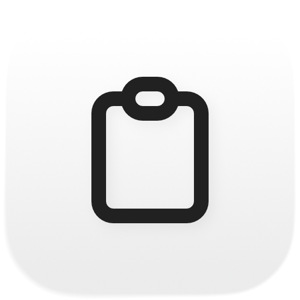

<div align="center">
<picture>
<source media="(prefers-color-scheme: dark)" srcset="Docs/icon-dark.png" />

</picture>
<h1>clipboard-controller</h1>
<p><strong>A menu bar clipboard history and clipboard cleaner for macOS.</strong></p>
<p>
<a href="https://github.com/fballiano/clipboard-controller/releases/latest"></a>
<a href="https://github.com/fballiano/clipboard-controller/releases"></a>

<a href="LICENSE"></a>
</p>
<p><a href="https://github.com/fballiano/clipboard-controller/releases/latest"></a></p>
</div>

<table align=center><tr><td align=center>
<strong>If you find my work valuable, please consider sponsoring</strong><br />
<a href="https://github.com/sponsors/fballiano" target=_blank title="Sponsor me on GitHub"></a>
<a href="https://www.buymeacoffee.com/fballiano" target=_blank title="Buy me a coffee"></a>
<a href="https://www.paypal.com/paypalme/fabrizioballiano" target=_blank title="Donate via PayPal"></a>
</td></tr></table>

---

## Features

<table>
<tr><td><b>Every copy, kept</b></td><td>Text, formatted text, links and images go into a history that the menu gives back.</td></tr>
<tr><td><b>Plain text by default</b></td><td>The formatting goes away as you copy, so a paste never brings a strange font.</td></tr>
<tr><td><b>Clean links</b></td><td>About 200 tracking parameters go, from <code>utm_source</code> to the ones that X, TikTok and Amazon add.</td></tr>
<tr><td><b>No hidden characters</b></td><td>Zero width characters, bidirectional marks and the Unicode tags block, where a text generator hides a watermark.</td></tr>
<tr><td><b>Passwords stay out</b></td><td>A clipboard that a password manager marks is never read, never cleaned and never stored.</td></tr>
<tr><td><b>Pin and search</b></td><td>A pinned clip stays at the top and no limit deletes it. A search window reaches the whole history.</td></tr>
<tr><td><b>Scriptable</b></td><td>AppleScript, Shortcuts and Spotlight drive the same commands.</td></tr>
<tr><td><b>Light and dark</b></td><td>The icon follows the system, in the menu bar and in the Finder.</td></tr>
<tr><td><b>Six languages</b></td><td>English, Italian, French, Spanish, Brazilian Portuguese and German. The application follows the language of the system.</td></tr>
</table>

## Install

With [Homebrew](https://brew.sh):

```bash
brew tap fballiano/clipboard-controller https://github.com/fballiano/clipboard-controller
brew trust --cask fballiano/clipboard-controller/clipboard-controller
brew install --cask clipboard-controller
```

The URL is part of the first command, because this repository is the tap itself.
Homebrew 6 refuses to load a cask from a tap outside `Homebrew/*` until you
trust it, so the second command is also necessary.

Or download the DMG from the
[latest release](https://github.com/fballiano/clipboard-controller/releases/latest).
Open it and drag **clipboard-controller** into **Applications**.

> [!IMPORTANT]
> The application is signed ad hoc, not with an Apple Developer ID, so macOS
> blocks the first launch. Open **System Settings → Privacy & Security** and
> select **Open Anyway**. Homebrew also marks the application, so this step
> applies to both ways to install.
>
> A terminal does the same thing:
>
> ```bash
> xattr -dr com.apple.quarantine /Applications/clipboard-controller.app
> open /Applications/clipboard-controller.app
> ```

The application has no dock icon. It appears in the menu bar.

| Item | Value |
| --- | --- |
| macOS | 15.0 or later |
| Hardware | Apple silicon and Intel (universal binary) |
| Permissions | None. The application never presses <kbd>⌘</kbd><kbd>V</kbd> for you, so it needs no Accessibility permission. |

## The menu

| Item | What it does |
| --- | --- |
| Private mode | The first item. Stores nothing until you turn it off. The icon carries a line. <kbd>⇧</kbd><kbd>⌘</kbd><kbd>P</kbd> while the menu is open. |
| Automatic cleaning | Cleans each new content of the clipboard. |
| Clean the clipboard now | Cleans what is on the clipboard at this moment. |
| The clips | A click puts the clip back on the clipboard. <kbd>⌘</kbd><kbd>1</kbd> to <kbd>⌘</kbd><kbd>9</kbd> reach the first nine. |
| Search… | Opens the whole history with a search field. |
| Export… | Writes the history to a JSON file. |
| Clear the history | Deletes every clip that is not pinned. |

Each clip carries a submenu: **Copy**, **Copy as plain text**, **Pin**,
**Rename…** and **Delete**.

## Settings

Open **Preferences…** from the menu, or press <kbd>⌘</kbd><kbd>,</kbd>.

### General

| Setting | Default | What it does |
| --- | --- | --- |
| Record the clipboard | on | Stores what you copy. |
| Store the images | on | Also keeps the pictures, with a small copy for the menu. |
| Show N clips in the menu | 20 | How many clips the menu lists. |
| Delete the old clips automatically | on, keep 200 | Keeps only the newest N clips. |
| Delete a clip after some days | off | An age limit, from 1 to 365 days. |
| Start clipboard-controller at login | **on** | Registers a login item through `SMAppService`. The first launch switches it on. A later change by you stays. |

A pinned clip stays. No limit ever deletes it.

### Cleaning

| Setting | Default | What it does |
| --- | --- | --- |
| Clean each new clipboard | on | The master switch of the cleaner. |
| Remove the formatting | on | Keeps the words, throws the fonts and the colours away. |
| Keep the links | off | Keeps the links of a formatted text. |
| Remove the invisible characters | on | Zero width characters, bidirectional marks and the Unicode tags block. A no-break space becomes an ordinary space. |
| Normalize the quotes | off | A curly quote becomes a straight quote. `…` becomes `...`. |
| Normalize the ends of the lines | on | Every end of line becomes a line feed. Two or more empty lines become one. |
| Turn a bullet into a hyphen | off | `• one` becomes `- one`. |
| Remove the space at the start and at the end | on | Also removes the space at the end of each line. |
| Remove the tracking parameters of a URL | on | About 200 known parameters, plus the rules of 20 sites. |

An emoji keeps its zero width joiner, so 👨‍👩‍👧 stays one picture and does not
become three people.

### Privacy

Two lists: the applications that the history ignores, and the applications that
the cleaner ignores. A button opens the Applications folder and reads the bundle
identifier of the application you select.

### Shortcuts

Four global hot keys: automatic cleaning, clean the clipboard now, private mode
and open the history. No shortcut is set until you record one.

## Automation

```applescript
tell application "clipboard-controller" to clean clipboard        -- returns true or false
tell application "clipboard-controller" to start cleaning
tell application "clipboard-controller" to stop cleaning
tell application "clipboard-controller" to start private mode
tell application "clipboard-controller" to stop private mode
tell application "clipboard-controller" to last clip              -- returns the newest text
tell application "clipboard-controller" to clear history
```

From a terminal:

```bash
osascript -e 'tell application "clipboard-controller" to clean clipboard'
```

The same commands are App Intents, so the Shortcuts app lists them under
**clipboard-controller**: Clean Clipboard, Set Automatic Cleaning, Set Private
Mode, Get Last Clip and Clear Clipboard History. Spotlight runs them too.

## Export

`Export…` writes a JSON array, pinned clips first, then the newest:

```json
[
  {
    "date" : "2026-08-21T19:30:00+01:00",
    "kind" : "url",
    "pinned" : false,
    "source" : "Safari",
    "text" : "https://example.com/page",
    "title" : "https://example.com/page",
    "useCount" : 2
  }
]
```

`kind` is `plainText`, `richText`, `url` or `image`. An image writes an empty
`text`, so the file stays readable.

## Privacy

The application stores everything on your Mac. It sends nothing anywhere. It has
no network code at all.

Four rules are always on. No setting turns them off:

- A password manager marks its clipboard with `org.nspasteboard.ConcealedType`.
  The application does not read that clipboard, does not clean it, and does not
  store it.
- A clipboard marked as transient or auto-generated belongs to another tool. The
  application skips it.
- The cleaner never touches a clipboard that holds a file.
- The cleaner never touches a picture.

## Where the data lives

| What | Where |
| --- | --- |
| Clips | `~/Library/Application Support/clipboard-controller/clipboard-controller.store` (SwiftData) |
| Settings | `~/Library/Preferences/com.fabrizioballiano.clipboard-controller.plist` |

<details>
<summary><strong>Build from source</strong></summary>

<br />

You need Xcode 26 or later.

```bash
make install     # build the Release app and copy it to /Applications
```

Other targets:

```bash
make build       # build only
make test        # run the unit tests
make run         # build, then launch
make dmg         # build the Release app and pack it into ./dist/*.dmg
make generate    # rebuild ClipboardController.xcodeproj from project.yml (needs xcodegen)
make uninstall   # remove /Applications/clipboard-controller.app
```

To work in Xcode, open `ClipboardController.xcodeproj` and press Run. The project
signs ad hoc, which is enough for your own Mac. To sign with your Apple ID,
select the `ClipboardController` target, open **Signing & Capabilities**, and
choose your team.

`ClipboardController.xcodeproj` is generated from `project.yml`, but it is
committed, so you do not need XcodeGen unless you change the project layout.

A push of a tag `v*` builds the DMG and publishes a release from GitHub Actions.

</details>

<details>
<summary><strong>How it is built</strong></summary>

<br />

| Part | Choice |
| --- | --- |
| Language | Swift 6, strict concurrency |
| Interface | AppKit `NSMenu` for the menu, SwiftUI for the windows |
| Storage | SwiftData |
| Global hot keys | [KeyboardShortcuts](https://github.com/sindresorhus/KeyboardShortcuts) |
| Login item | `SMAppService` |
| Tests | Swift Testing |
| Project file | XcodeGen |
| Translations | A string catalog, `Localizable.xcstrings` |

```
Sources/ClipboardController/
├── ClipboardControllerApp.swift  the scenes
├── AppModel.swift                the one controller
├── ClipboardMonitor.swift        the watcher of the clipboard
├── Pasteboard.swift              the clipboard, behind a protocol
├── ClipboardContent.swift        what was read, and the settings that decide
├── Clip.swift                    the stored model
├── ClipStore.swift               read, write, prune, export
├── ImageSupport.swift            the pictures and their small copies
├── Preferences.swift             the settings
├── HotKeys.swift                 the global shortcut names
├── LoginItem.swift               start at login
├── Cleaning/                     the cleaner and its two tables
├── Views/                        the menu, the settings, the history
└── Scripting/                    AppleScript commands and App Intents

Resources/
└── Localizable.xcstrings         the six languages of the interface
```

Every command has one code path. The menu, a hot key, an AppleScript command and
a Shortcuts action all call the same method on `AppModel`.

A few details worth knowing:

- macOS sends no notification for a change of the clipboard, so the application
  reads `changeCount` four times a second. The timer runs in the common run loop
  mode, so it keeps working while the menu is open.
- The watcher stores the `changeCount` of its own write, so the cleaner never
  reads its own result and cleans it a second time.
- The same content does not make a second row. The old row moves to the top and
  counts one more use.
- `Sanitizer` is a pure type: no state, no system, no AppKit. Every rule of the
  cleaner lives there, so a test reads a rule without a clipboard.
- A short parameter name like `s` or `ref` is a search term on most sites, so it
  lives in a rule for one host and never in the global table.

</details>

## Credits

Third-party material is listed in [NOTICE.md](NOTICE.md).

## Licence

MIT. See [LICENSE](LICENSE).
